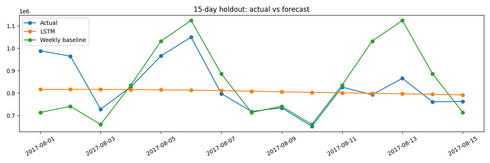

# Evaluation report

Status: **MEASURED_REAL_DATA** — automated verification run on 6 October 2026. These are newly generated results, not outputs preserved in the student's supplied notebook.

## Setup

- 3,000,888 train rows; 1,688 daily observations.
- Holdout: 2017-08-01 through 2017-08-15 (15 days).
- Seed 42; 30 epochs per model; device cpu; 30-day lookback.
- 4 absent calendar days filled causally.
- Scaling fit only on pre-holdout history; recursive forecasts use their own predictions.
- Same horizon and actuals for both baselines and LSTM. Hyperparameters fixed before evaluation.

## Results in original sales units

| Model | MAE | RMSE |
|---|---:|---:|
| LSTM | 86,572.20 | 110,238.77 |
| weekly_naive | 100,229.66 | 139,177.31 |
| last_value | 113,643.98 | 125,349.59 |

The lowest MAE belongs to **LSTM**. The comparison does not justify assuming that deep learning is superior to a simple baseline. The pipeline preserves the LSTM required by the project and reports this outcome openly.

## Error analysis

Largest LSTM absolute error: 236,687.11 sales units, on 2017-08-06. Review the daily residuals in reports/validation_actual_vs_predicted.csv. Aggregate patterns, holiday effects and promotions can produce errors that this univariate model cannot represent. This is a short single holdout, not rolling cross-validation or a statistical superiority test.

## Future forecast

Final model refit on all history after holdout evaluation. Forecast dates: 2017-08-16 through 2017-08-30. The Kaggle test file has 16 days, but the first 15 are selected intentionally. Future actual sales are unavailable; forecast values are not evidence of accuracy. The output is an aggregate CSV, not a competition submission.

## Verification

Five unit tests passed: temporal target alignment, recursive self-feeding, metric units, insufficient-history rejection and LSTM shape. Both 30-epoch training phases completed. Generated CSVs contain 15 rows; future predictions are finite/nonnegative; metrics were independently recomputed from saved CSVs. Notebook code compiles and its embedded pipeline matches src/forecast.py. The Colab upload interface was not interactively executed; the complete computational pipeline was executed locally.

Exact data hashes and runtime versions: reports/metrics.json. Raw source: public mirror of the Kaggle dataset documented in DATA_CARD.md. Original notebook SHA-256: 71c0eb71d954755589b0eb715ea53f69ab689635a6860f5af9a1ff25ea48e16c.

Visual review: the LSTM trajectory is nearly flat and under-represents daily oscillations. Its MAE is about 13.6% lower than the weekly baseline in this particular window, but that does not establish broad superiority. Additional rolling-origin windows and seasonal/calendar features are needed.
