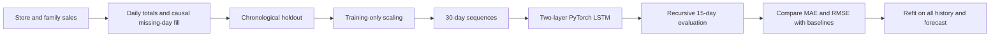
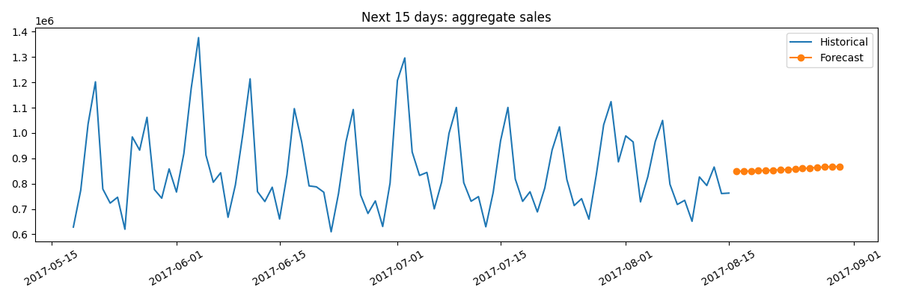

# Sales Forecasting with LSTM and PyTorch

**Anas Ibrahim Al-Mutairi | أنس إبراهيم المطيري** · GitHub: [Ans212121](https://github.com/Ans212121)

مشروع توقّع إجمالي المبيعات اليومية باستخدام شبكة LSTM ضمن دورة **التعلم العميق باستخدام PyTorch** في **أكاديمية طويق**.

The project aggregates historical store and product-family sales into one daily series, uses 30 days to predict the next day, and recursively forecasts the next 15 days. A chronological 15-day holdout measures MAE/RMSE against weekly and last-value baselines. The final model is retrained on all history after evaluation.

[Open in Google Colab](https://colab.research.google.com/github/Ans212121/pytorch/blob/main/notebooks/sales_forecasting_lstm.ipynb) · [Notebook](notebooks/sales_forecasting_lstm.ipynb) · [Evaluation](EVALUATION_REPORT.md)

## Run

Use Python 3.12. Download `train.csv` and `test.csv` from the [Kaggle competition](https://www.kaggle.com/competitions/store-sales-time-series-forecasting/data), observing its rules, and place them in `data/`.

```bash
pip install -r requirements.txt
python src/forecast.py --train data/train.csv --test data/test.csv --output . --epochs 30
```

In Colab, run the notebook and upload both CSV files when prompted. It embeds the pipeline and does not require cloning the repository. Local training writes metrics, comparison CSVs, the forecast, four figures, loss history and a model checkpoint containing its scaler parameters.

## Method



LSTM: 64 hidden units, 2 layers, dropout 0.2, linear output, Adam at 0.001, batch size 64, 30 epochs, seed 42. Missing dates use forward-fill to avoid future information entering historical gaps. Holdout actuals are never fed into the recursive predictions. Baselines use exactly the same dates.

## Evidence

Measured 15-day holdout: LSTM MAE **86,572.20**, RMSE **110,238.77**; weekly baseline MAE **100,229.66**, RMSE **139,177.31**. LSTM MAE improves about **13.6%** in this window, while its forecast remains nearly flat. See the evaluation report for interpretation and limitations.

See [reports/metrics.json](reports/metrics.json) for runtime, hashes, data sizes and measured metrics; [EVALUATION_REPORT.md](EVALUATION_REPORT.md) interprets them. Future predictions have no known ground truth and are not accuracy evidence.




## Files

| Path | Purpose |
|---|---|
| `notebooks/sales_forecasting_lstm.ipynb` | Self-contained Colab/local workflow |
| `notebooks/source_sales_forecasting.ipynb` | Sanitized supplied notebook, preserved as provenance |
| `src/forecast.py` | Reproducible command-line training and evaluation |
| `reports/` | Measured results, predictions and figures |
| `models/` | Trained weights and scaler parameters |
| `DATA_CARD.md`, `MODEL_CARD.md` | Data and model scope |
| `DECISIONS.md`, `SUBMISSION.yml` | Decisions and requirement mapping |
| `tests/` | Temporal sequence and evaluation integrity checks |

## Scope and limitations

This is an educational aggregate forecast. It is not the official Kaggle store × family submission. Holidays, promotions and exogenous features are excluded. A single short holdout does not establish performance across seasons; rolling-origin validation is a next step. The baselines may outperform the LSTM. No production or competition-ranking claim is made.

## Contribution and AI assistance | المساهمة والاستعانة بالأدوات

The supplied project notebook is preserved as the source of this work. ChatGPT by OpenAI assisted in reviewing it, making local and Colab execution reproducible, adding baseline evaluation, saving model/scaler artifacts, validating the pipeline and preparing documentation. The original supplied notebook had no completed training outputs; new results are labeled as the automated verification run, not as a prior student run. The learner should review the method and results before presenting them.

## Training context and acknowledgement | شكر وذكر طويق

**Tuwaiq Academy — أكاديمية طويق** · Deep Learning using PyTorch · 16–27 August 2026 · 20 hours (attendance certificate supplied by the learner).

Thank you to [Tuwaiq Academy](https://tuwaiq.edu.sa/) and [@Tuwaiq-Academy-Training](https://github.com/Tuwaiq-Academy-Training) for the training context. **#TuwaiqAcademy #أكاديمية_طويق**

شكرًا لأكاديمية طويق على برنامج التعلم العميق باستخدام PyTorch. هذا مشروع تعليمي شخصي ولا يدل على اعتماد أو تبنّي الأكاديمية له.

Dataset credit: Corporación Favorita / Kaggle. Libraries: PyTorch, NumPy, pandas, scikit-learn and Matplotlib. No raw course materials, identity-bearing certificate, private screenshots or raw dataset are redistributed. Source attribution does not transfer third-party rights.

Horizon correction: the Kaggle test file has 16 dates (16–31 August 2017). The original notebook used all test dates while labeling them 15 days. The revised pipeline explicitly selects the first 15 (16–30 August) to match the project goal.
